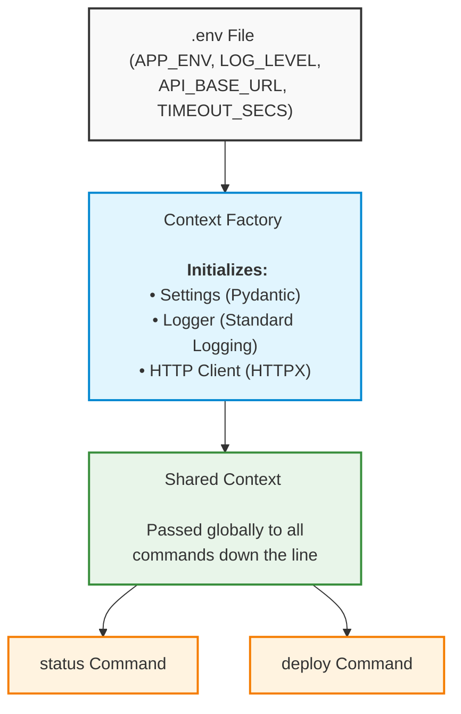

```python
import os

readme_content = """# DevOps CLI Tool (`myapp`)

A context-aware Command Line Interface (CLI) tool designed for streamlined infrastructure and deployment operations. Built with a robust, production-grade architecture featuring unified state management, decoupled environments, and automated testing capabilities.

## Architecture & Concept

This tool is designed around a **Context-Aware** architecture pattern. Instead of every isolated command re-initializing loggers, rebuilding network configurations, or reading environment variables independently, a single, global `Context` object is initialized at runtime. This bundle manages shared dependencies across all terminal execution flows.





### Core Architecture Components
* **Configuration (`Settings`)**: Managed via `pydantic-settings` to guarantee strict type-safety, default fallbacks, and painless loading from `.env` files.
* **State Carrier (`Context`)**: A lightweight Python `dataclass` encapsulating configuration settings, a structured logger instance, and an isolated stateful synchronous HTTP client (`httpx.Client`).
* **Command Router (`cli.py`)**: Built on top of `Typer`, translating declarative Python functions directly into beautiful, production-ready Unix-style terminal utilities.

---

## Features & Capabilities

### 1. Unified Environment Lifecycle Configuration
The tool decouples execution parameters completely from code execution. Environment overrides can be swapped seamlessly by updating an external runtime state or a `.env` file structure:

| Parameter | Environment Key | Default | Purpose |
| :--- | :--- | :--- | :--- |
| **Environment** | `APP_ENV` | `"dev"` | Targets runtime level (`dev`, `staging`, `prod`) |
| **Log Level** | `LOG_LEVEL` | `"INFO"` | Standard streams verbosity filtering |
| **API Base Address** | `API_BASE_URL` | `None` | The orchestration controller URL to hit |
| **Network Timeout** | `TIMEOUT_SECS` | `30` | Request timeout ceiling before failure |

### 2. Live Health Checking (`status`)
Polls target core cloud components to evaluate operational integrity.
* **Action**: Performs an HTTP `GET` request to your configured `{API_BASE_URL}/health`.
* **Debugging Flag**: Appending `--verbose` or `-v` dynamically forces the logging runtime into `DEBUG` mode on the fly to print granular connection internals.

### 3. Orchestration & Continuous Deployment (`deploy`)
Safely pipes deployment instructions down to your infrastructure controller pipeline.
* **Action**: Ships a structured JSON payload via an HTTP `POST` to `{API_BASE_URL}/deploy`.
* **Payload Schema**: Passes an explicit immutable string variable (`tag`) identifying the docker image/revision target.

---

## Technical Stack

* **CLI Framework**: [Typer](https://typer.tiangolo.com/) (FastAPI's sister framework for rapid terminal composition)
* **Networking Engine**: [HTTPX](https://www.python-httpx.org/) (Next-generation, highly performant HTTP transport engine)
* **Validation Engine**: [Pydantic (BaseSettings)](https://docs.pydantic.dev/) (Strict type enforcement for environment profiles)
* **Testing Harness**: [Pytest](https://docs.pytest.org/) & `typer.testing.CliRunner`

---

## Quickstart & Local Installation

### Prerequisites
* Python 3.10 or greater
* Poetry, Hatch, or standard Pip tools

### 1. Setup Environment Configuration
Create a `.env` file in the root execution workspace of the project:

```bash
# .env Configuration Example
APP_ENV=staging
LOG_LEVEL=INFO
API_BASE_URL=[https://api.internal.devops.company.com](https://api.internal.devops.company.com)
TIMEOUT_SECS=15

```

### 2. Local Editable Installation

Install the project dependencies and bind the console entrypoint:

```bash
pip install -e .

```


## Usage Guide

Once installed, use the globally mapped command binary `myapp`.

### Execute System Status Diagnostics

```bash
$ myapp status
2026-05-20 00:24:11,542 INFO myapp - Checking status
OK: healthy

```

### Toggle Verbose Debug Output

```bash
$ myapp status --verbose
2026-05-20 00:24:15,102 DEBUG myapp - Context created
2026-05-20 00:24:15,103 DEBUG myapp - Checking status
OK: healthy

```

### Trigger a System Deployment

```bash
$ myapp deploy v2.4.1-rc1
2026-05-20 00:24:20,311 INFO myapp - Triggering deploy {"tag": "v2.4.1-rc1"}
Deploy started

```

---

## Automated Test Harness

The engine separates production side-effects by utilizing a full dependency injection architecture via Pytest fixtures.

Tests run against an isolated `DummyClient` that mocks remote HTTP payloads, ensuring your local codebase won't accidentally trigger a production release when running unit testing suites.

To run the local testing execution profile, execute:

```bash
> pytest tests/
```
